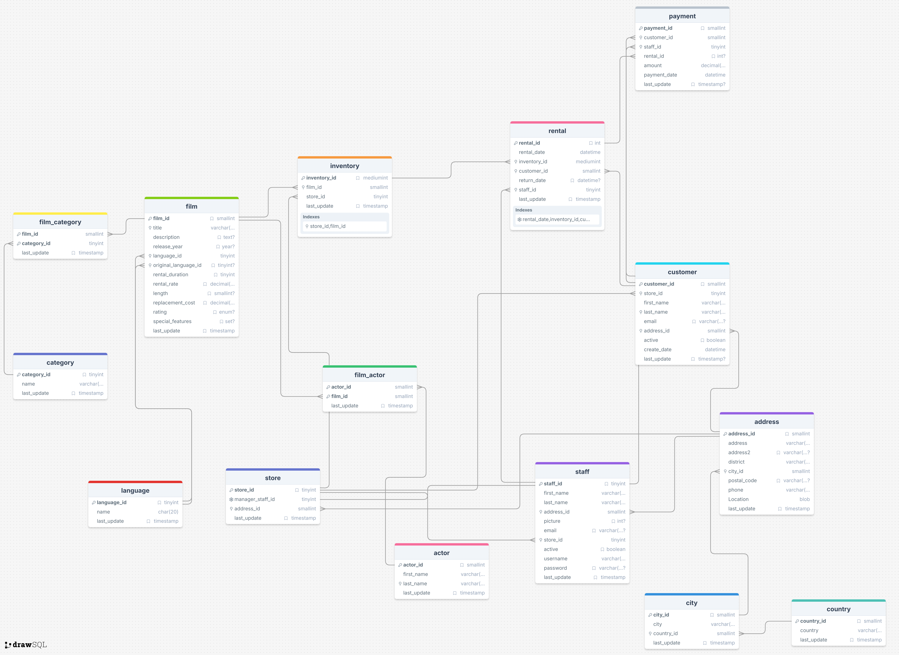
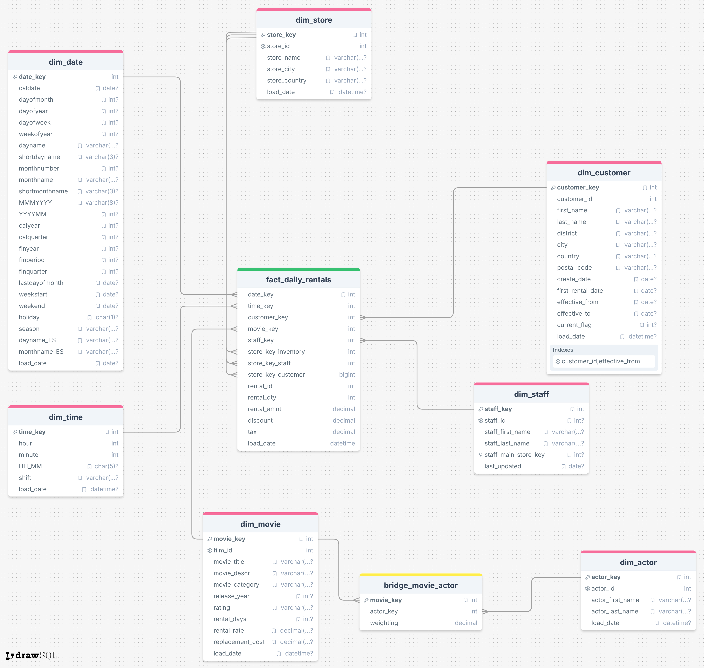

# Sakila Data Warehouse - Dimensional Modeling Project

## 📋 Project Overview

This project demonstrates a complete **data warehouse design and implementation** using the Sakila database as the source system. The project follows the **Kimball dimensional modeling methodology** to transform an OLTP database into an analytics-ready data warehouse optimized for business intelligence and reporting.

---

## 🎯 Project Objectives

- Apply the **Four-Step Dimensional Design Process** (Kimball Methodology)
- Transform a normalized OLTP schema into a denormalized star schema
- Implement **Slowly Changing Dimensions (SCD Type 2)** for historical tracking
- Design fact and dimension tables optimized for analytical queries

---

## 🏗️ Architecture

### Source System Analysis

Before beginning the design process, we must analyze the source system.

The **Sakila OLTP Database** consists of 15 normalized tables grouped into:

You can find the You can find the ERD below:

.

|Domain|Tables|Description|
|---|---|---|
|**Film Catalog**|`film`, `film_actor`, `film_category`, `category`, `language`|Content management|
|**Operations**|`store`, `inventory`|Physical inventory tracking|
|**People**|`customer`, `staff`, `actor`, `address`, `city`, `country`|Entities and locations|
|**Transactions**|`rental`, `payment`|Business events|

For further investigation of the source data, see the [source system analysis](source/source_system_analysis.sql).

---

## Dimensional Model Process

After becoming familiar with the source system data and business requirements, we apply the [Four-Step Dimensional Design Process](https://www.kimballgroup.com/data-warehouse-business-intelligence-resources/kimball-techniques/dimensional-modeling-techniques/four-4-step-design-process/) to this use case.

#### **Step 1: Select the Business Process**

- **Business Process:** DVD Rental Transaction

#### **Step 2: Declare the Grain**

- **Grain:** One row per DVD rented, by one customer, on one date, at one specific hour, at one store

#### **Step 3: Identify the Dimensions**

Dimensions are the **context** around the event.

|Dimension|Business Question|Analysis Purpose|
|---|---|---|
|`dim_date`|When (date)?|Trends by day/month/quarter/year, fiscal periods, holidays|
|`dim_time`|When (time)?|Peak hours, shift analysis, time-of-day patterns|
|`dim_customer`|Who rented?|Customer segmentation, loyalty analysis, geographic trends|
|`dim_staff`|Who served?|Staff performance, productivity metrics|
|`dim_movie`|What was rented?|Film popularity, genre analysis, pricing optimization|
|`dim_actor`|Who starred?|Actor popularity, casting decisions|
|`dim_store`|Where?|Store performance comparison, regional analysis|

#### **Step 4: Identify the Facts**

Facts are the **measurements** of the event, the actual numbers to analyze.

|Fact|Meaning|
|---|---|
|`rental_qty`|Number of DVDs rented|
|`rental_amount`|Revenue collected|
|`discount`|Discounts given|
|`tax`|Tax collected|

After completing the four-step process, see the resulting logical model below:

---

### Physical Design

The data warehouse is implemented as a **star schema** consisting of 7 dimension tables, 1 fact table, and 1 bridge table.

#### [**Date Dimension**](dwh/date_dim.sql)

**Source Mapping:** Generated table. not sourced from Sakila directly; populated programmatically from `rental.rental_date` and `payment.payment_date` date ranges.

> A calendar with 30+ attributes covering day, week, month, quarter, and year breakdowns, plus fiscal period support, weekend/holiday flags, seasonal labels, and Spanish language name variants.

---

#### [**Time Dimension**](dwh/dim_time.sql)

**Source Mapping:** Generated table. time values extracted from the time component of `rental.rental_date`.

> Enables sub-day analysis by decomposing rental timestamps into hour, minute, HH:MM format, and named business shift. useful for identifying peak rental hours and staff workload patterns.

---

#### [**Customer Dimension**](dwh/dim_customer_SCD2.sql)

**Source Mapping:** `customer` → joined with `address`, `city`, `country` for geographic enrichment.

|DWH Column|Source|
|---|---|
|`customer_id`|`customer.customer_id`|
|`first_name`, `last_name`|`customer`|
|`district`, `city`, `country`, `postal_code`|`address` → `city` → `country`|
|`create_date`, `first_rental_date`|`customer.create_date`, derived from `rental`|
|`effective_from`, `effective_to`, `current_flag`|SCD Type 2 control columns|

---

#### [**Staff Dimension**](dwh/dim_staff.sql)

**Source Mapping:** `staff` table directly.

|DWH Column|Source|
|---|---|
|`staff_id`|`staff.staff_id`|
|`staff_first_name`, `staff_last_name`|`staff`|
|`staff_main_store_key`|`staff.store_id` → resolved to `dim_store.store_key`|

---

#### [**Movie Dimension**](dwh/dim_movie.sql)

**Source Mapping:** `film` → joined with `film_category` + `category` for genre, and `language` for the language name.

|DWH Column|Source|
|---|---|
|`film_id`|`film.film_id`|
|`movie_title`, `movie_descr`|`film.title`, `film.description`|
|`movie_category`|`category.name` via `film_category`|
|`release_year`, `rating`|`film`|
|`rental_days`|`film.rental_duration`|
|`rental_rate`, `replacement_cost`|`film`|

---

#### [**Actor Dimension**](dwh/dim_actor.sql)

**Source Mapping:** `actor` table directly.

|DWH Column|Source|
|---|---|
|`actor_id`|`actor.actor_id`|
|`actor_first_name`, `actor_last_name`|`actor`|

---

#### [**Store Dimension**](dwh/dim_store_roleplaying.sql) `role palying`

**Source Mapping:** `store` → joined with `address`, `city`, `country`.

|DWH Column|Source|
|---|---|
|`store_id`|`store.store_id`|
|`store_name`|Derived (e.g. "Store 1")|
|`store_city`, `store_country`|`address` → `city` → `country`|

---

#### [**Bridge Table** `bridge_movie_actor` ](dwh/bridge_movie_actor.sql)

**Source Mapping:** `film_actor` join table, resolved through `dim_movie` and `dim_actor` surrogate keys.

|DWH Column|Source|
|---|---|
|`movie_key`|Resolved from `film_actor.film_id`|
|`actor_key`|Resolved from `film_actor.actor_id`|
|`weighting`|Derived: `1 / COUNT(actors per film)`|

> 📝 Solves the many-to-many relationship. The `weighting` column distributes fact measures evenly across all actors in a film, preventing metric inflation when querying actor-level aggregates.

---

#### [**Fact Table**](dwh/fact_daily_rentals.sql)

**Source Mapping:** `rental` (primary) → joined with `payment` for financial measures, `inventory` for store resolution.

|DWH Column|Source|
|---|---|
|`date_key`, `time_key`|Derived from `rental.rental_date`|
|`customer_key`|`rental.customer_id` → `dim_customer`|
|`movie_key`|`inventory.film_id` → `dim_movie`|
|`staff_key`|`rental.staff_id` → `dim_staff`|
|`store_key_inventory`|`inventory.store_id` → `dim_store`|
|`store_key_staff`|`staff.store_id` → `dim_store`|
|`store_key_customer`|`customer.store_id` → `dim_store`|
|`rental_id`|`rental.rental_id` (degenerate dimension)|
|`rental_qty`|Derived: 1 per rental row|
|`rental_amnt`|`payment.amount`|
|`discount`, `tax`|Derived / business logic|

> 📝 The fact table captures three different store perspectives (inventory, staff, and customer home store) as separate foreign keys — this design choice allows analysts to slice revenue by whichever store definition is most relevant to the business question.

